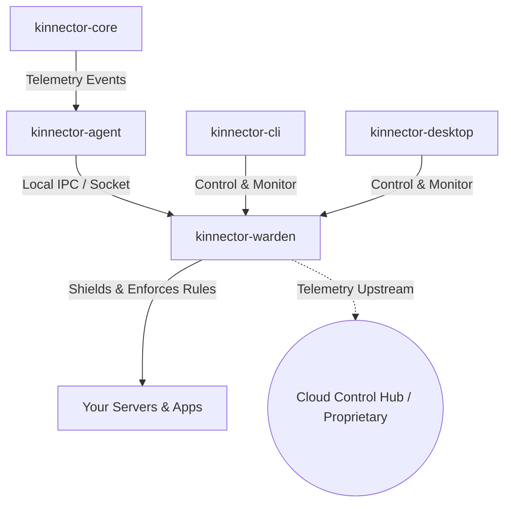

# Kinnector 🛡️

**Kinnector** is an open-source, telemetry-driven security platform designed to monitor, shield, and protect backend servers and application runtimes in real time. 

By separating low-level telemetry collection from high-level enforcement and dashboards, Kinnector provides a lightweight, non-intrusive, and highly modular security layer for modern infrastructure.

---

## 🏗️ System Architecture

Kinnector's ecosystem is built out of modular components designed to work seamlessly together:



---

## 📦 Repositories

Explore the components of the Kinnector ecosystem:

### ⚙️ Core & Telemetry
*   **[kinnector-core](https://github.com/kinnector/kinnector-core)**: The low-level telemetry-gathering engine. Intercepts system events and gathers performance/security metrics with minimal overhead.
*   **[kinnector-agent](https://github.com/kinnector/kinnector-agent)**: The local daemon process. Receives telemetry stream from the core and forwards it to the warden or custom backends.

### 🛡️ Runtime Protection
*   **[kinnector-warden](https://github.com/kinnector/kinnector-warden)**: The active security protector and shield. Warden sits on the backend server to monitor runtime behavior, enforce rules, and actively block malicious activity in real time.
*   **[kinnector-protect](https://github.com/kinnector/kinnector-protect)**: Security policies, configurations, and baseline rulesets used by Warden to identify and mitigate threats.

### 💻 User Interfaces
*   **[kinnector-cli](https://github.com/kinnector/kinnector-cli)**: The terminal-based (console) dashboard client to monitor security logs, inspect agent status, and manage warden configurations.
*   **[kinnector-desktop](https://github.com/kinnector/kinnector-desktop)**: The cross-platform GUI desktop dashboard for visual management and real-time alerts.

### 🔌 Integrations & Deployments
*   **[kinnector-wordpress](https://github.com/kinnector/kinnector-wordpress)**: Official WordPress plugin and integration for protecting WordPress application environments.
*   **[kinnector-docker](https://github.com/kinnector/kinnector-docker)**: Docker Compose files and containerization scripts to deploy the Kinnector stack locally with one command.
*   **[kinnector-installer](https://github.com/kinnector/kinnector-installer)**: Bootstrapping scripts and installer packages for quick deployment across Linux environments.
*   **[kinnector-docs](https://github.com/kinnector/kinnector-docs)**: Central developer and user documentation website.

---

## 🚀 Getting Started (Local Development)

To spin up a local development environment of the Kinnector stack:

1. Clone the orchestration repository with submodules:
   ```bash
   git clone --recurse-submodules https://github.com/kinnector/kinnector-docker.git
   cd kinnector-docker
   ```
2. Build and start the services locally:
   ```bash
   docker-compose up --build
   ```

---

## 🤝 Contributing

We welcome contributions from the security and open-source community! Please see our main [Documentation](https://github.com/kinnector/kinnector-docs) for guidelines on code styles, telemetry schemas, and vulnerability reporting.
